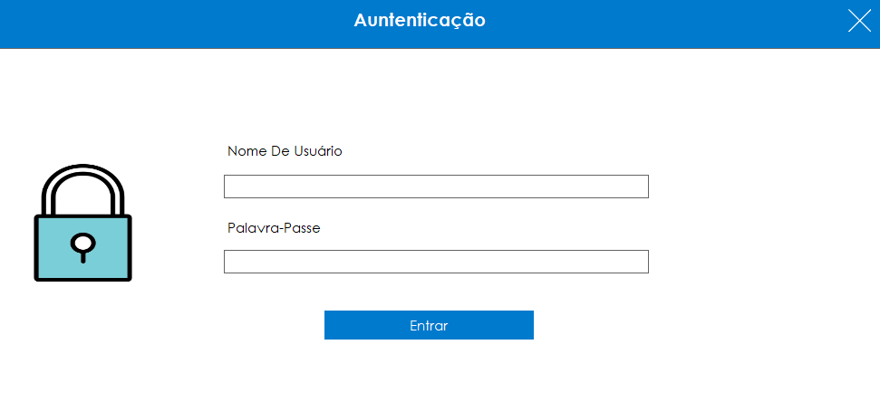
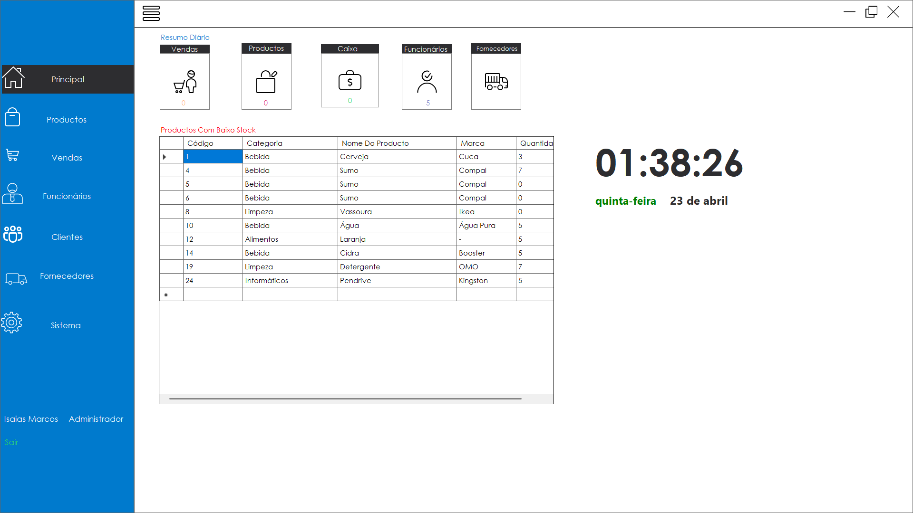
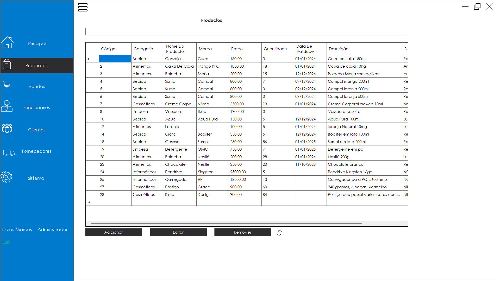
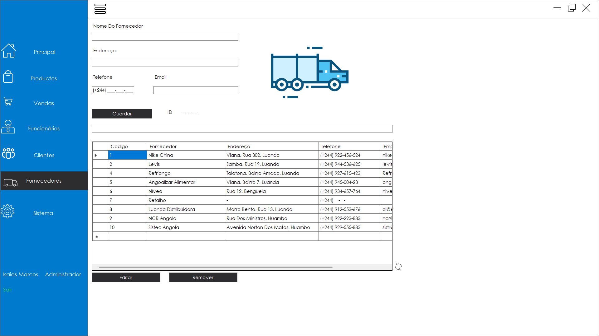
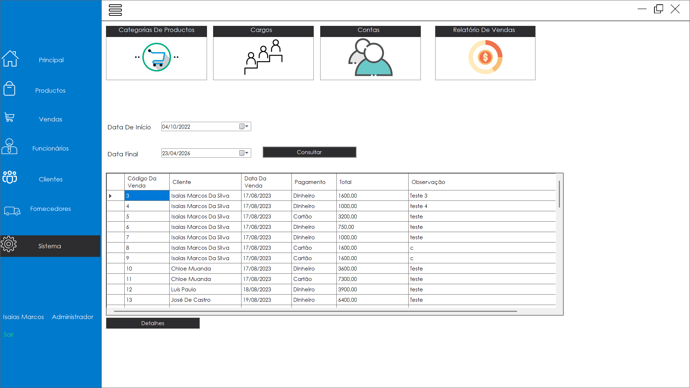

# 🖥️ Sales Stock Management System

Sistema desktop completo para gestão de vendas, produtos e controle de stock, desenvolvido em C# com persistência em MySQL.

Projetado para uso real em pequenos e médios negócios, permitindo controle eficiente das operações comerciais no dia a dia.

---

## 📌 Sobre o Sistema

Este sistema foi desenvolvido com foco em aplicações reais de mercado, podendo ser implementado em lojas, armazéns e outros tipos de negócio que necessitam de:

- Controle de stock  
- Registro de vendas  
- Organização de produtos  
- Gestão de operações comerciais  

A aplicação oferece uma interface simples, funcional e adaptada a ambientes empresariais que utilizam soluções desktop.

---

## 🧱 Arquitetura do Sistema

O projeto foi estruturado com foco em organização, manutenção e escalabilidade:

- **MVC (Model-View-Controller)**  
  Responsável pela separação entre interface, lógica e dados  

- **DAO (Data Access Object)**  
  Centraliza o acesso ao banco de dados e isola queries SQL  

Essa abordagem permite um código mais limpo, reutilizável e de fácil manutenção.

---

## ⚙️ Tecnologias Utilizadas

- Linguagem: C#  
- Interface: Windows Forms  
- Banco de Dados: MySQL  
- Plataforma: .NET  

---

## 🚀 Funcionalidades

- 📦 Cadastro e gestão de produtos  
- 🧾 Registro de vendas  
- 💰 Cálculo automático de valores  
- 📊 Controle de stock  
- 📋 Listagem e consulta de dados  
- 💾 Persistência de dados em banco MySQL  

---

## 🎯 Aplicação no Mundo Real

Este sistema pode ser utilizado em:

- Lojas de varejo  
- Pequenos comércios  
- Armazéns  
- Negócios locais que necessitam de controle de vendas e stock  

---

## 📷 Interface do Sistema

### 🔐 Tela de Login


### 🔐 Tela de Login


### 📦 Gestão de Produtos


### 🧾 Vendas


### 🔐 Tela de Login


### 🔐 Tela de Login


### 📊 Dashboard


---

## ▶️ Como Executar

### Pré-requisitos

- Visual Studio  
- .NET instalado  
- Servidor MySQL configurado  

---

### Instalação

```bash
git clone https://github.com/IsaiasMuanda/sales-stock-management-system.git
